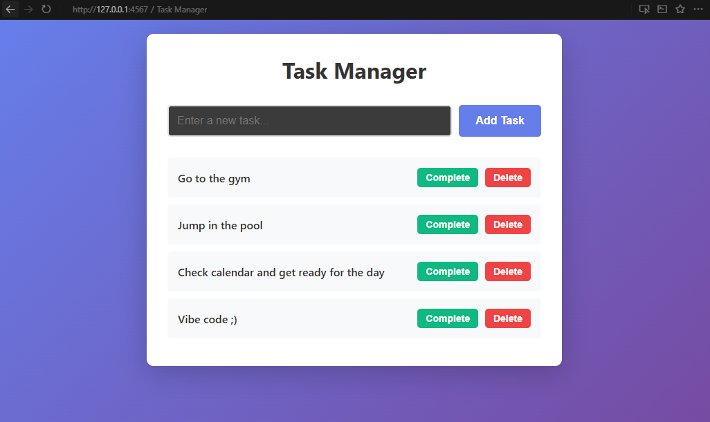
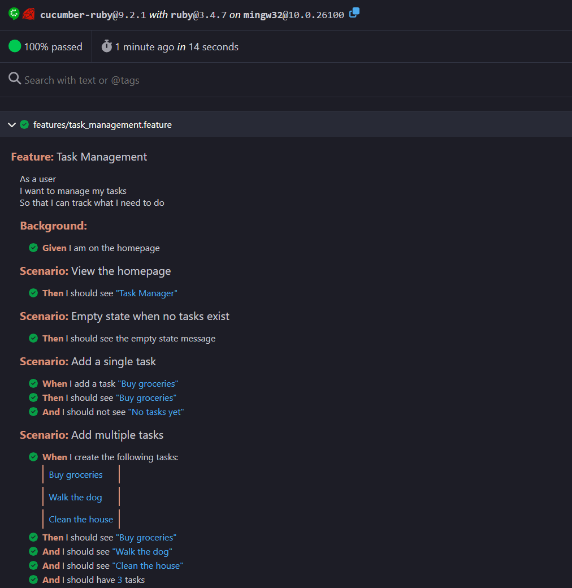
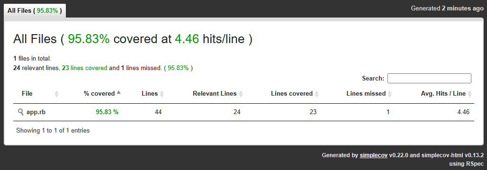

# Capybara BDD Demo - Task Manager

A simple Task Manager web application built with Sinatra and tested with Capybara using **both RSpec and Cucumber** to demonstrate different BDD approaches.



## Features

- Add new tasks
- Mark tasks as complete
- Delete tasks
- Clean, modern UI with gradient background

## Tech Stack

- **Ruby 3.4.7**
- **Sinatra 4.1** - Lightweight web framework
- **Capybara 3.40** - BDD testing framework
- **RSpec 3.13** - Developer-focused BDD testing
- **Cucumber 9.2** - Business-readable BDD testing with Gherkin
- **Rack::Test** - Testing HTTP requests

## Project Structure

```
capybara-demo/
├── app.rb                          # Main Sinatra application
├── config.ru                       # Rack configuration
├── Gemfile                         # Ruby dependencies
├── views/
│   ├── layout.erb                  # Main layout with styling
│   └── index.erb                   # Task list view
├── spec/                           # RSpec tests
│   ├── spec_helper.rb              # RSpec and Capybara configuration
│   └── features/
│       └── task_management_spec.rb # RSpec BDD feature tests
└── features/                       # Cucumber tests
    ├── task_management.feature     # Gherkin scenarios
    ├── step_definitions/
    │   └── task_steps.rb           # Step definitions
    └── support/
        └── env.rb                  # Cucumber environment setup
```

## Installation

1. Install dependencies:
```bash
bundle install
```

## Running the Application

Start the web server:
```bash
bundle exec rackup -p 4567
```

Then visit [http://localhost:4567](http://localhost:4567) in your browser.

## Continuous Integration

This project includes a GitHub Actions workflow that automatically runs all tests on every push and pull request.

### Workflow Configuration
**File:** [.github/workflows/test.yml](.github/workflows/test.yml)

**Triggers:**
- Push to `main` or `develop` branches
- Pull requests to `main` or `develop` branches

**What it does:**
1. Sets up Ruby 3.4
2. Installs dependencies with Bundler
3. Runs RSpec tests
4. Runs Cucumber tests (using headless `rack_test` driver for speed)

**Note:** The Cucumber tests automatically use the headless `rack_test` driver in CI environments, while using the visible Firefox browser for local development.

## Running Tests

This project includes **two complete test suites** demonstrating different BDD approaches:

### Option 1: RSpec Tests (Developer-focused)

Run all RSpec tests:
```bash
bundle exec rspec
```

Run specific test file:
```bash
bundle exec rspec spec/features/task_management_spec.rb
```

**Output:** 7 examples, 0 failures

### Option 2: Cucumber Tests (Business-readable)

Run all Cucumber tests:
```bash
bundle exec cucumber
```

Run specific feature file:
```bash
bundle exec cucumber features/task_management.feature
```

**Output:** 7 scenarios, 36 steps - all passing

## Test Reports

This project generates comprehensive test reports and code coverage:

### Generated Reports

When you run tests, the following reports are automatically generated:

**RSpec Reports:**
- `reports/rspec_results.html` - Human-readable HTML report
- `reports/rspec_results.xml` - JUnit XML format (for CI tools)

**Cucumber Reports:**
- `reports/cucumber_results.html` - Beautiful HTML report with step details
- `reports/cucumber_results.json` - JSON format (for integrations)

**Code Coverage:**
- `coverage/index.html` - SimpleCov coverage report showing which lines were tested
- View your code coverage percentage and identify untested code

### Viewing Reports Locally

After running tests, open the reports in your browser:

```bash
# Run tests to generate reports
bundle exec rspec
bundle exec cucumber

# Open HTML reports (Windows)
start reports/rspec_results.html
start reports/cucumber_results.html
start coverage/index.html

# Open HTML reports (Mac/Linux)
open reports/rspec_results.html
open reports/cucumber_results.html
open coverage/index.html
```

### Reports in CI/CD

GitHub Actions automatically uploads all reports as artifacts:
1. Go to your repository's "Actions" tab
2. Click on any workflow run
3. Download "test-reports" artifact (contains all reports and coverage)
4. Unzip and open the HTML files in your browser

Reports are retained for 30 days.

### Sample Reports

**Cucumber HTML Report:**



Beautiful, interactive report showing all features, scenarios, and steps with pass/fail status.

**Code Coverage Report:**



SimpleCov coverage showing **95.83% code coverage** - 23 out of 24 lines covered with detailed line-by-line analysis.

## BDD Test Coverage

The test suite covers:

- **Homepage Display**: Verifies title and empty state
- **Adding Tasks**: Single and multiple task creation
- **Completing Tasks**: Marking tasks as complete
- **Deleting Tasks**: Removing tasks from the list
- **Full Workflow**: End-to-end user journey

All tests use Capybara's intuitive DSL:
- `visit '/'` - Navigate to pages
- `fill_in` - Enter text in forms
- `click_button` - Interact with buttons
- `expect(page).to have_content` - Verify page content
- `within` - Scope assertions to specific elements

## RSpec vs Cucumber - Side-by-Side Comparison

Both test suites test the **exact same functionality** but with different approaches:

### RSpec Approach (Developer-focused)
**File:** [spec/features/task_management_spec.rb](spec/features/task_management_spec.rb)

```ruby
describe 'Adding tasks' do
  it 'allows user to add a new task' do
    visit '/'
    fill_in 'task_name', with: 'Buy groceries'
    click_button 'Add Task'
    expect(page).to have_content('Buy groceries')
  end
end
```

**Pros:**
- Written in Ruby - familiar to developers
- Faster to write and execute
- More flexible for complex assertions
- No extra abstraction layer

**Configuration:** [spec/spec_helper.rb](spec/spec_helper.rb)

### Cucumber Approach (Business-readable)
**File:** [features/task_management.feature](features/task_management.feature)

```gherkin
Feature: Task Management
  As a user
  I want to manage my tasks
  So that I can track what I need to do

  Scenario: Add a single task
    When I add a task "Buy groceries"
    Then I should see "Buy groceries"
```

**Step Definitions:** [features/step_definitions/task_steps.rb](features/step_definitions/task_steps.rb)

```ruby
When('I add a task {string}') do |task_name|
  fill_in 'task_name', with: task_name
  click_button 'Add Task'
end
```

**Pros:**
- Plain English - readable by non-technical stakeholders
- Living documentation
- Promotes collaboration between business and tech
- Reusable step definitions

**Configuration:** [features/support/env.rb](features/support/env.rb)

## Capybara Configuration

This project demonstrates different Capybara driver configurations:

### RSpec Configuration ([spec/spec_helper.rb](spec/spec_helper.rb))
- **Driver:** `:rack_test` (default, headless)
- **Speed:** Very fast
- **Browser:** No actual browser - simulates HTTP requests
- **JavaScript:** Not supported
- **Best for:** Fast unit/integration tests, CI/CD pipelines

### Cucumber Configuration ([features/support/env.rb](features/support/env.rb))
- **Driver:** `:selenium_firefox` (visible browser)
- **Speed:** Slower but more realistic
- **Browser:** Opens Firefox and executes tests visually
- **JavaScript:** Full support
- **Best for:** Debugging, watching tests run, demos

### Available Selenium Drivers

Both Chrome and Firefox drivers are configured in [features/support/env.rb](features/support/env.rb):

**Switch to Chrome:** Edit line 29:
```ruby
Capybara.default_driver = :selenium_chrome
```

**Switch to headless (fast):** Edit line 29:
```ruby
Capybara.default_driver = :rack_test
```

### What is rack-test?

`rack-test` is Capybara's default driver that simulates a browser without actually opening one. It:
- Makes direct HTTP requests to your Rack application (Sinatra uses Rack)
- Doesn't support JavaScript
- Is extremely fast since no real browser is involved
- Perfect for simple web apps without complex JavaScript

### Common Configuration
- Both test suites clear task data before each test/scenario
- Both include Capybara DSL for browser automation
- Both test the same Sinatra application

## Learning Resources

- [Capybara Documentation](https://teamcapybara.github.io/capybara/)
- [RSpec Documentation](https://rspec.info/)
- [Cucumber Documentation](https://cucumber.io/docs/cucumber/)
- [Gherkin Syntax Reference](https://cucumber.io/docs/gherkin/)
- [Sinatra Documentation](https://sinatrarb.com/)

## When to Use Which?

**Choose RSpec + Capybara when:**
- Your team is primarily developers
- You want faster test execution
- You need complex test logic and assertions
- Documentation for non-technical stakeholders isn't critical

**Choose Cucumber + Capybara when:**
- You need non-technical stakeholders to read/write tests
- You want living documentation in plain English
- You're doing acceptance testing with business rules
- You want to ensure everyone (business + tech) agrees on requirements

**This project demonstrates both** so you can compare and choose what works best for your team!
